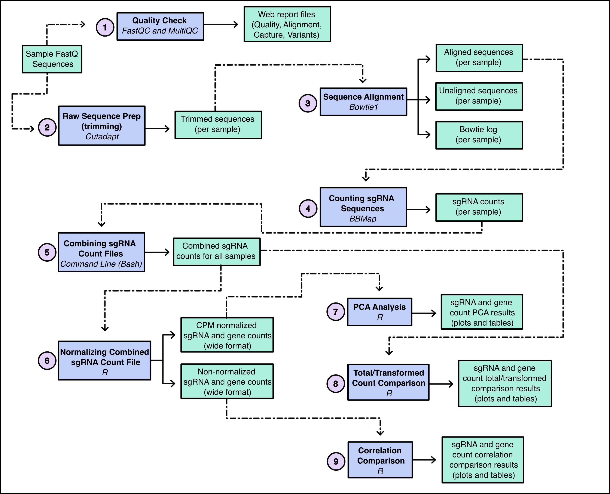

# functional_CRISPR_screen

Automated pipeline for functional CRISPR screen analyses

## Workflow Overview



| Workflow Step                            | Why we do this                                                                                                                                                                              |
|-------------------------|-----------------------------------------------|
| 1: Quality Check                         | Done to assess the overall quality of the sequences we received prior to additional analysis.                                                                                               |
| 2: Raw Sequence Prep (trimming)          | To trim all found sequences from the 5' end to 20 base pairs (bp) in length based on the vector sequence of the library that was used. All sgRNA sequences should be about 20 bp in length. |
| 3: Sequence Alignment                    | To map the trimmed sgRNA sequences to the associated library that they were prepped with to see which sgRNA sequences are present.                                                          |
| 4: Counting sgRNA Sequences              | To count how many sgRNA sequences and genes mapped to the sgRNA index for each sample.                                                                                                      |
| 5: Combining sgRNA Count Files           | To combine the sgRNA count data for each sample into one file for downstream R comparison analysis.                                                                                         |
| 6: Normalizing Combined sgRNA Count File | To generate all needed files to perform PCA, total/transformed count, and correlation R analysis. sgRNA and gene count data are normalized to counts per million (CPM).                     |
| 7: PCA Analysis                          | Plotted at the sgRNA and gene level to see if biological replicates cluster together as they should.                                                                                        |
| 8: Total/Transformed Count Comparison    | Plotted at the sgRNA and gene level to ensure that biological replicates have about the same distribution of counts.                                                                        |
| 9: Correlation Comparison                | Plotted at the sgRNA and gene level to ensure that biological group replicates correlate more closely with each other than replicates in a different biological group.                      |

## Installation

Information on how to pull the automated pipeline off of GitHub to your local computer and get it running on your own functional CRISPR screen data!!

**These instructions have a few assumptions:**

**1. That you already have conda or a conda-like entity (micromamba, mambaforge, miniconda, etc.) installed on your local computer (if you don't have this installed, [do so now](https://github.com/conda-forge/miniforge))**

**2. That you have [git](https://github.com/git-guides/install-git) installed on your local computer**

**3. That you have [snakemake v8.27.1](https://snakemake.readthedocs.io/en/stable/getting_started/installation.html) installed in a conda environment (preferrably one that only contains snakemake)**

### Step 1:

On your local computer, navigate to where you'd like the directory for the automated pipeline to live. If you don't do this, GitHub will clone the repository to wherever you currently are in your file system when you call `git clone` (which you don't want, or maybe you do, I don't know your life). Then type this command in your terminal:

``` bash
git clone https://github.com/Comp-Bio-Pipeline-Dev-Team/functional_CRISPR_screen.git
```

### Step 2:

When the command finishes, a directory titled `functional_CRISPR_screen` should exist in your working directory. Navigate into the `functional_CRISPR_screen` directory and open the file titled `run_workflow.sh` via your favorite text editor. The contents of the file should look like so:

``` bash
#!/bin/bash 

functional_CRISPR_screen.py \
    --cores 10 \ ## default
    --raw_seq_dir 'directory_with_raw_seqs' \
    --metadata_file 'path_to_metadata_file' \
    --bowtie_mismatches 0 \ ## default
    --vector_seq_used 'TTGTGGAAAGGACGAAACACCG' \
    --vector_seq_minOverlap 10 \ ## default
    --vector_seq_error 0.2 \ ## deafult
    --crispr_sgRNA_index "path_to_sgRNA_index_fasta" \
    --crispr_sgRNA_index_name "name_of_sgRNA_index" \
    --use_conda True \ ## only include this line if you want to run the pipeline in conda environments
    --dry_run True ## only include this line if you want to dry run the pipeline 
```

This script just includes the command line parameters for the pipeline and allows you to easily add file paths to your input sequences, the sgRNA index `.fasta` file, and your metadata file. The input parameters also include the ability to run the pipeline in associated conda environments instead of docker containers and to dry run the pipeline once you put in all parameters to make sure that provided files are located where you said they were.

### Step 3:

Once you have entered/modified the parameters in `run_workflow.sh` as needed, you can run the pipeline! Make sure that you're still within the `functional_CRISPR_screen` directory when you do this and that you've activated the conda environment containing `snakemake`.

You may need to make `run_workflow.sh` executable in your local computer which can be done by running the following commands. You will need to add the path to the directory that `run_workflow.sh` lives in to your global path (the example below will work for Linux and Mac operating systems, check the appropriate documentation if you're doing this on a Windows system).

``` bash
## makes the script below executable
chmod u+x run_workflow.sh

## add the path to the script to your global path
export PATH=/path/to/functional_CRISPR_screen/:$PATH

## adding the line above to your .bashrc/.zshrc will keep executable status of the script
echo 'export PATH=/path/to/functional_CRISPR_screen/:$PATH' >> ~/.bashrc
```

Now you should be able to just type the name of the script into your terminal and press enter and the pipeline will run.

``` bash
run_workflow.sh
```

*Note: If you run the commands above and you're still getting an error, attempt the same steps with the functional_CRISPR_screen.py script instead.*

You don't need to use the `run_snakemake.sh` script if you don't want to and can put the `functional_CRISPR_screen.py` command and parameters directly in the terminal. You'll know that the pipeline is successfully running once the text you see below is printed to your terminal.

``` bash
host: im-super1
Building DAG of jobs...
Using shell: /usr/bin/bash
Provided cores: 10
Rules claiming more threads will be scaled down.
Singularity containers: ignored
Job stats:
job                           count
--------------------------  -------
all                               1
assemble_stat_table               4
combine_stat_table                1
normalize_counts                  1
prep_count_files                  1
render_report                     1
run_bbmap                         4
run_bowtie                        4
run_correlation                   1
run_cutadapt                      4
run_fastqc                        1
run_multiqc                       1
run_pca                           1
run_total_transform_counts        1
total                            26

Select jobs to execute...
Execute 5 jobs...
```

## Pipeline Specifics

### Inputs:

Pipeline inputs and definitions are as follows:

1\. **--cores:** The number of cores you want dedicated to the analysis, set to 10 as a default but should be changed based on the resources of where you're running the pipeline (i.e. local computer or HPC)

2\. **--raw_seq_dir:** The path to the directory containing the raw sequence `.fastq.gz` files

3\. **--metadata_file:** The path to the metadata file as a `.csv`

4\. **--bowtie_mismatches:** This is set to 0 as a default but can be changed if the user wishes to

5\. **--vector_seq_used:** The sgRNA vector sequence used in the wet lab experiments

6\. **--vector_seq_minOverlap:** This is set to a default of 10 but can be changed

7\. **--vector_seq_error:** This is set to a default of 0.2 but can be changed

8\. **--crispr_sgRNA_index:** The path to the sgRNA index `.fasta` file

9\. **--crispr_sgRNA_index_name:** The name of the sgRNA index that was used (where you got the associated `.fasta` file from)

10\. **--use_conda:** Optional parameter to run the pipeline in conda environments instead of docker containers

11\. **--dry_run:** Optional parameter to dry run the pipeline to ensure that all file paths/parameters are referenced appropriately

| Parameter                 | Expected Type          | Input Required, Default, or Optional | Description                                                                                                      |
|------------------|------------------|------------------|------------------|
| --cores                   | numeric                | default = 10                         | The number of cores you want dedicated to the analysis, default of 10                                            |
| --raw_seq_dir             | string of file path    | required                             | The path to the directory containing the raw sequence `.fastq.gz` files                                          |
| --metadata_file           | string of file path    | required                             | The path to the metadata file as a `.csv`                                                                        |
| --bowtie_mismatches       | numeric                | default = 0                          | This is set to a default of 0 but can be changed                                                                 |
| --vector_seq_used         | string of the sequence | required                             | The sgRNA vector sequence used in the wet lab experiments                                                        |
| --vector_seq_minOverlap   | numeric                | default = 10                         | This is set to a default of 10 but can be changed                                                                |
| --vector_seq_error        | numeric                | default = 0.2                        | This is set to a default of 0.2 but can be changed                                                               |
| --crispr_sgRNA_index      | string of file path    | required                             | The path to the sgRNA index `.fasta` file                                                                        |
| --crispr_sgRNA_index_name | string                 | required                             | The name of the sgRNA index that was used (where you got the associated `.fasta` file from)                      |
| --use_conda               | True (bool)            | optional                             | Optional parameter to run the pipeline in conda environments instead of docker containers                        |
| --dry_run                 | True (bool)            | optional                             | Optional parameter to dry run the pipeline to ensure that all file paths/parameters are referenced appropriately |

### Outputs:

Pipeline outputs are contained in a directory named `crispr_screen_out` which should exist in your working directory upon completion of the pipeline. The directory will be structured like so:

``` bash
crispr_screen_out/
├── bowtie_aligned
│   ├── sample1_mismatches_allowed.log
│   ├── sample1_mismatches_allowed.sam
│   ├── sample2_mismatches_allowed.log
│   └── sample2_mismatches_allowed.sam
├── bowtie_unaligned
│   ├── sample1_mismatches_allowed_unaligned.sam
│   └── sample2_mismatches_allowed_unaligned.sam
├── count_output
│   ├── allSample_counts_long.tsv
│   ├── allSample_counts.tsv
│   ├── allSample_geneCounts_wide.tsv
│   ├── allSample_sgRNAcounts_wide.tsv
│   ├── norm-cpm_allSample_geneCounts.tsv
│   ├── norm-cpm_allSample_sgRNAcounts.tsv
│   ├── sample1_bbpileup.log
│   ├── sample1_counts_final.txt
│   ├── sample1_counts.txt
│   ├── sample2_bbpileup.log
│   ├── sample2_counts_final.txt
│   └── sample2_counts.txt
├── cutadapt_outputs
│   ├── sample1_trimmed.fastq.gz
│   ├── sample1_untrimmed.fastq.gz
│   ├── sample2_trimmed.fastq.gz
│   └── sample2_untrimmed.fastq.gz
├── dev_report.html
├── fastqc_outputs
│   ├── sample1_fastqc.html
│   ├── sample1_fastqc.zip
│   ├── sample2_fastqc.html
│   └── sample2_fastqc.zip
├── multiqc_outputs
│   ├── fastqc_crispr_screen_data
│   │   ├── fastqc_adapter_content_plot.txt
│   │   ├── fastqc_overrepresented_sequences_plot.txt
│   │   ├── fastqc_per_base_n_content_plot.txt
│   │   ├── fastqc_per_base_sequence_quality_plot.txt
│   │   ├── fastqc_per_sequence_gc_content_plot_Counts.txt
│   │   ├── fastqc_per_sequence_gc_content_plot_Percentages.txt
│   │   ├── fastqc_per_sequence_quality_scores_plot.txt
│   │   ├── fastqc_sequence_counts_plot.txt
│   │   ├── fastqc_sequence_duplication_levels_plot.txt
│   │   ├── fastqc-status-check-heatmap.txt
│   │   ├── fastqc_top_overrepresented_sequences_table.txt
│   │   ├── multiqc_citations.txt
│   │   ├── multiqc_data.json
│   │   ├── multiqc_fastqc.txt
│   │   ├── multiqc_general_stats.txt
│   │   ├── multiqc.log
│   │   ├── multiqc_software_versions.txt
│   │   └── multiqc_sources.txt
│   └── fastqc_crispr_screen.html
├── plots
│   ├── geneCount_correlationMatrix.pdf
│   ├── geneCount_PCA_plot.pdf
│   ├── sample_totalCount_plot.pdf
│   ├── sample_transCounts_plot.pdf
│   ├── sgRNACount_correlationMatrix.pdf
│   └── sgRNACount_PCA_plot.pdf
└── qc_files
    ├── geneCount_correlation_results.tsv
    ├── geneCount_PCA_results.tsv
    ├── sample_summary_stat_table.tsv
    ├── sgRNACount_correlation_results.tsv
    ├── sgRNACount_PCA_results.tsv
    ├── total_count_results.tsv
    └── transform_count_results.tsv
```

To view the functional CRISPR screen analysis overview report, click on `dev_report.html`. All plots and stats are included in the respective `plots` and `qc_files` directories. Any intermediate files made by R are in the `count_output` directory along with the final sgRNA counts table per sample. The raw data at every step of the pipeline is provided for the user under the associated sub-directories with log files for how any given analysis went.

## Contact Information

This pipeline was written by Madi Apgar, MS and Tonya Brunetti, PhD of the Department of Microbiology and Immunology at CU Anschutz. If any issues arise, feel free to open an issue on this repository to bring it to our attention.