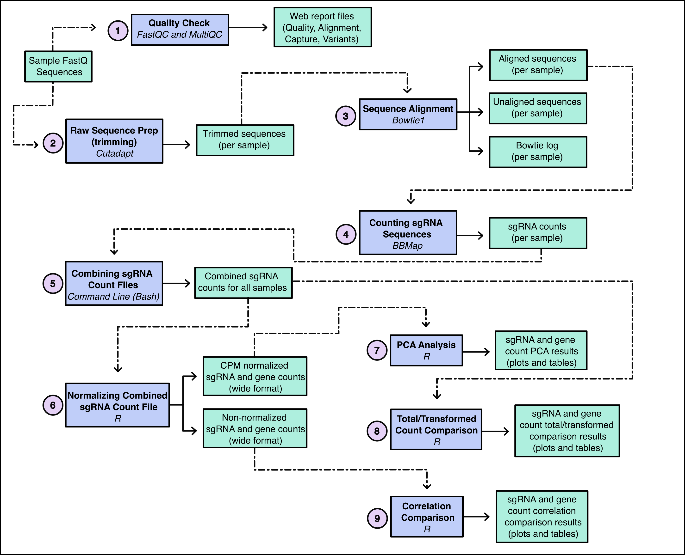
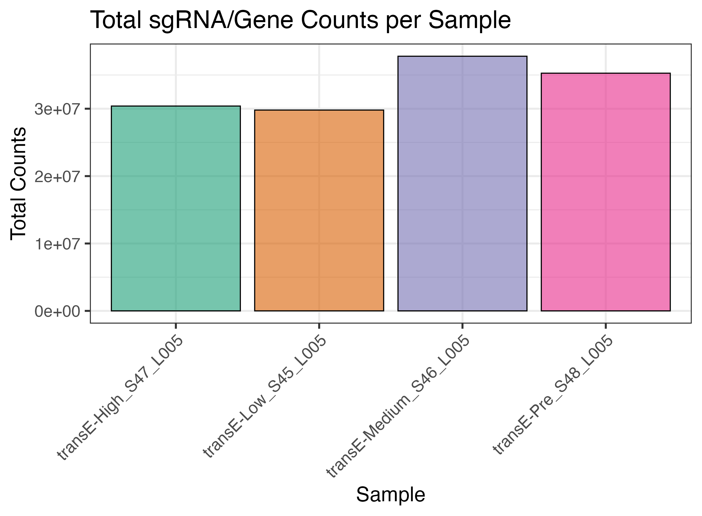
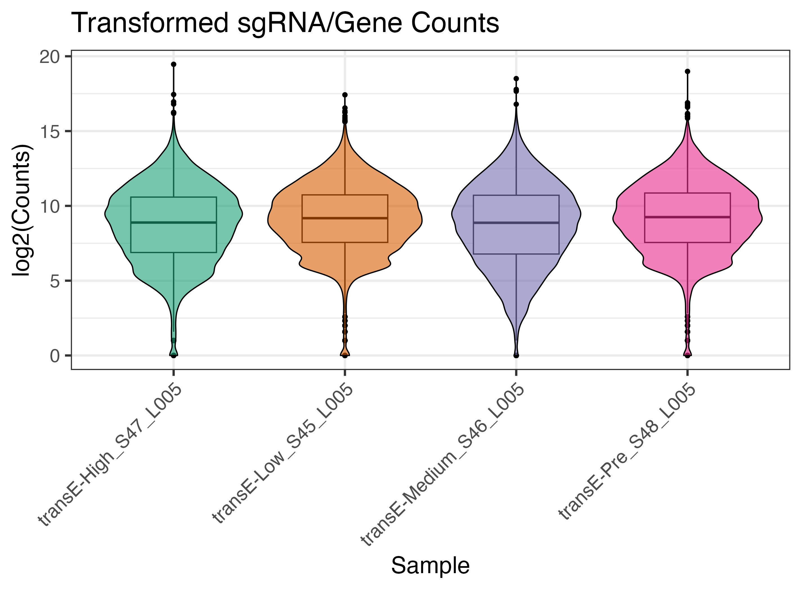
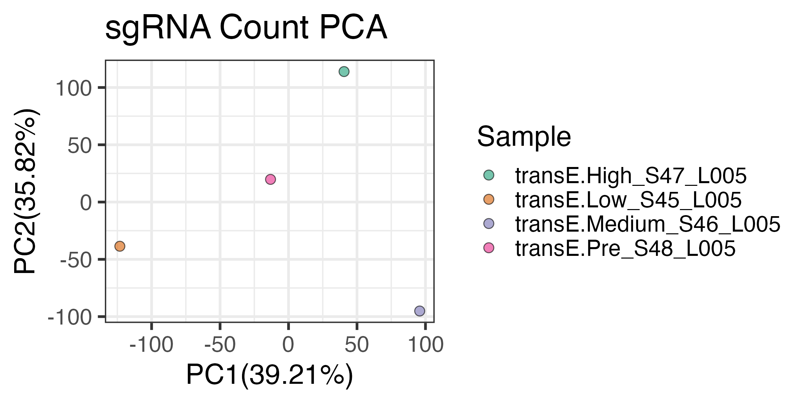
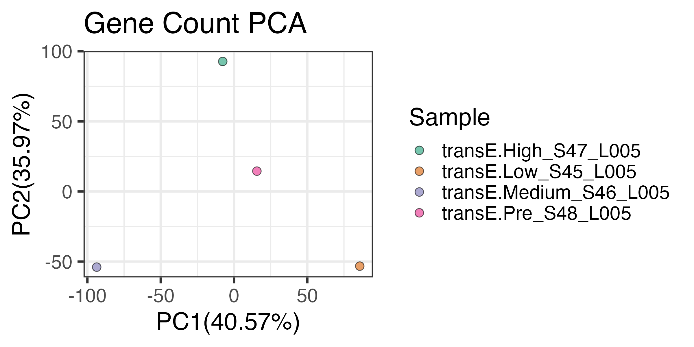
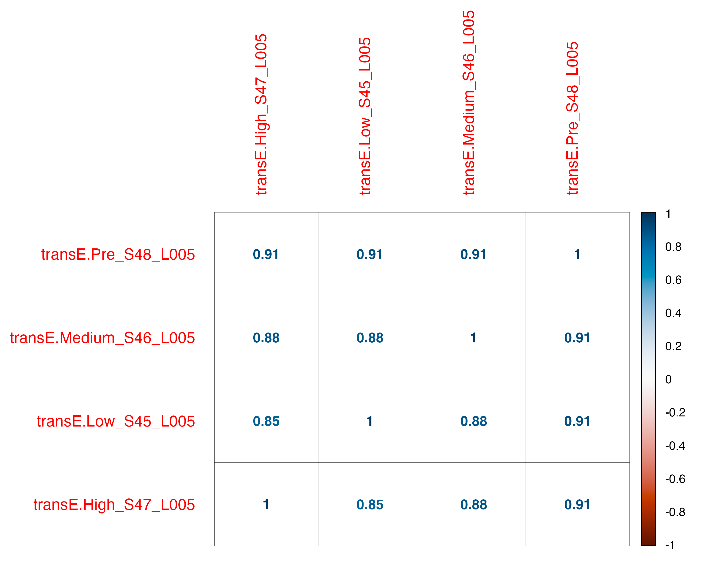
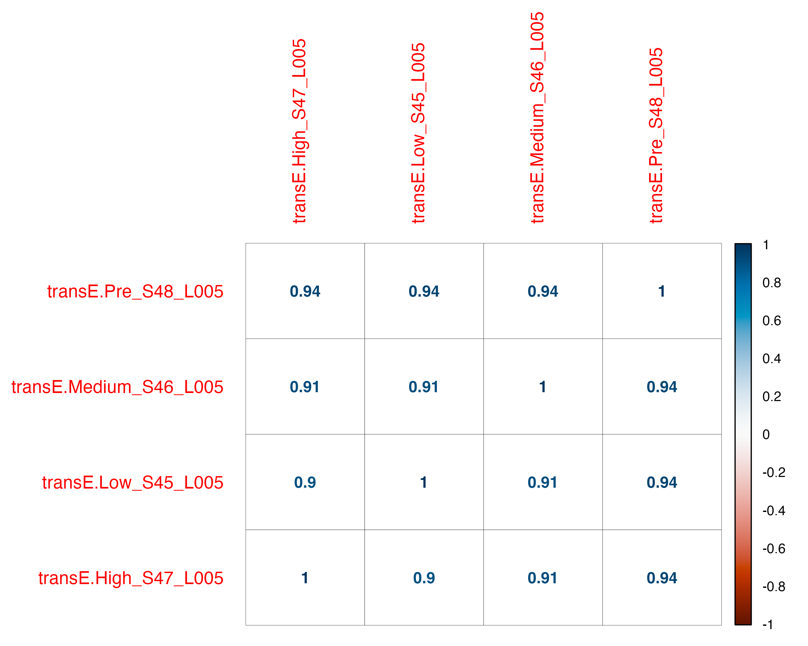

# so you've run a CRISPR functional screen but what does it mean?

Pooled functional CRISPR screens are typically used for detecting changes in gene expression across the genome when a library of genes are knocked out, ideally one at a time based on the sgRNA transuction efficiency and dilution.  These experiments tpically aim to determine which cells and guides survive after being subjected to set of selective pressures.  Some examples include the selective pressure based on cell survival of durg treatments and resistance, exposure to host-pathogen interactions, determination of the effects of sythentic lethal experiments, etc...  This pipeline automates the data processing steps from raw fastq files and generates both raw and normalized counts matrices summarized by both gene and sgRNA for all samples input into the pipeline.  This report strives to break down our analysis and show you preliminary results on the success of your experiment so you can move forward with your investigation.  

<br/>  

Often times, the goal of these experiments is to perform an analysis similar to bulk RNA-seq differential expression analysis, where different conditions are compared to determine which guides or genes are enriched one condition over another.  If the report and QC steps here look of high quality, we recommend you proceed with using DESeq2 to analyze the **raw NOT normalized** data matrices for DE testing.  We offer an R package with a template analysis script to help with these analysis, please reach out to us via email or github if you have any questions interpreting this repport of if you would like us to help with further downstream analysis or DE testing.    

# Analysis Summary Table

We have provided a summary table outlining how the raw sequences performed in during the pre-processing steps of the analysis. A successful functional CRISPR screen should show a very high proportion of the vector detected in your reads and of those reads with a vector sequences, most should align to a sgRNA sequence.  

```{r}
#| label: tbl-summaryStats
#| tbl-cap: "sample counts per analysis step"
#| tbl-colwidths: [60,40]

library(knitr)
library(readr)

summary_table <- read_tsv('summary_stats/sample_summary_stat_table.tsv', show_col_types = FALSE)

new_cols <- c('Sample ID',
'Total Reads Sequenced',
'Reads with Vector',
'Reads without Vector',
'Reads Aligned to sgRNA',
'Reads Not Aligned to sgRNA',
'Reads with Alignments Suppressed',
'Total sgRNA Represented',
'sgRNA > 10 Reads')

colnames(summary_table) <- new_cols

kable(summary_table, align='lcccccccc')
```

| Column                           | Explanation                                                                                                                                                              |
|--------------------------|----------------------------------------------|
| Total Reads Sequenced            | Total number of reads sequenced in your sample.                                                                                                                          |
| Reads with Vector                | Total number of reads containing the vector sequence. This is the number of reads used for alignment.                                                                    |
| Reads without Vector             | Total number of reads where the vector sequence was not detected and therefore not considered for sgRNA mapping. These reads are not included in the alignment step.     |
| Reads Aligned to sgRNA           | Total number of reads that contained a vector sequence that had a read aligning to a sgRNA at the set mismatch rate of .                    |
| Reads Not Aligned to sgRNA       | Total number of reads that contained a vector sequence where the vector sequence **did not** align to a sgRNA at the set mismatch rate of . |
| Reads with Alignments Suppressed | Total number of reads that contained a vector sequence that aligned more than once to a sgRNA. We want to guarantee that all reported alignments to a sgRNA are unique.  |
| Total sgRNA Represented          | The total number of unique guides with at least 1 read count detected. Percentage is based upon fasta of guide library used as the reference.                            |
| sgRNA \> 10 Reads                | The total number of unique guides with at least 10 read counts detected. Percentage is based upon fasta of guide library used as the reference.                          |

: summary table explained {tbl-colwidths="\[25,75\]".striped}

# What does the pipeline do?  

Below is an in-depth description of how we process your raw sequences including the software used, outputs, and why we perform each particular step. 

{width="2850"}

| Workflow Step                            | Why we do this                                                                                                                                                                              |
|--------------------------|----------------------------------------------|
| 1: Quality Check                         | Done to assess the overall quality of the sequences we received prior to additional analysis.                                                                                               |
| 2: Raw Sequence Prep (trimming)          | To trim all found sequences from the 5' end to 20 base pairs (bp) in length based on the vector sequence of the library that was used. All sgRNA sequences should be about 20 bp in length. |
| 3: Sequence Alignment                    | To map the trimmed sgRNA sequences to the associated library that they were prepped with to see which sgRNA sequences are present.                                                          |
| 4: Counting sgRNA Sequences              | To count how many sgRNA sequences and genes mapped to the sgRNA index for each sample.                                                                                                      |
| 5: Combining sgRNA Count Files           | To combine the sgRNA count data for each sample into one file for downstream R comparison analysis.                                                                                         |
| 6: Normalizing Combined sgRNA Count File | To generate all needed files to perform PCA, total/transformed count, and correlation R analysis. sgRNA and gene count data are normalized to counts per million (CPM).                     |
| 7: PCA Analysis                          | Plotted at the sgRNA and gene level to see if biological replicates cluster together as they should.                                                                                        |
| 8: Total/Transformed Count Comparison    | Plotted at the sgRNA and gene level to ensure that biological replicates have about the same distribution of counts.                                                                        |
| 9: Correlation Comparison                | Plotted at the sgRNA and gene level to ensure that biological group replicates correlate more closely with each other than replicates in a different biological group.                      |

: workflow diagram explained {tbl-colwidths="\[25,75\]".striped}

# Plots

We generate plots to validate that your experiment ran smoothly and that all biological replicates look similar to each other. There are a few different ways we do this; total and transformed sgRNA/gene counts, PCA analysis, and correlation analysis.

## total and transformed counts

We look at total and transformed sgRNA/gene counts to make sure that all samples and biological replicates have about the same amount.

### total counts

Total counts is the sum of the **raw, unnormalized counts** per sample for comparison. The plot is colored by biological group and all replicates should be next to each other on the x-axis.



### transformed counts

The total sgRNA/gene counts above undergo a log2() transformation to ensure that the distribution of counts per sample is similar across all samples. Like the plot above, the plot is colored by biological group and all replicates should be next to each other on the x-axis.



## PCA  

Next, the counts-per-million (CPM) normalized sgRNA and gene counts go through a principal components analysis (PCA) to look at the clustering of all replicates in a biological group, We expect replicates in the same biological group to cluster together. we do this for sgRNA and gene counts separately since they're different and thus give us slightly different PCA results.  Note, given that functional CRISPR screen can be quite complicated to set up, very often, we see that biological replicates do not cluster together and instead cluster by their batch (i.e. batch effect).  In this case, as long as the study design was appropriately set up with each batch representing all possible phenotypes and covariates, we can regress out the batch effect at time of running differential expression analysis.  **DO NOT PROCEED WITH DOWNSTREAM ANALYSIS UNTIL AN ANALYTIC PLAN AND CORRECTION IS IN PLACE IF THE PCA DOES NOT GROUP BY BIOLOGICAL REPLICATE GROUPS!!**  

### sgRNA count PCA

PCA was performed using the **CPM, normalized counts** at the _sgRNA level_.  



### gene count PCA

This was done using **CPM, normalized counts** at the _gene level_.  Several sgRNAs typically fall under one gene, so these are summed to collapse guides targeting the same gene.  



## correlation analysis

A Spearman correlation was performed to make sure that all replicates in a biological group correlate more closely with each other than other biological groups.  A correlation value closer to 1 between replicates of the same biological group is expected. Positive correlations will be deeper blue and negative correlations will be deeper red. Correlations on sgRNA and gene counts were analyzed separately.  

### sgRNA correlation comparisons

Spearman correlatoins using **CPM, normalized counts** at the sgRNA (sgRNA) level.  



### gene correlation comparisons

This was done using **CPM, normalized counts** at the _gene level_.  Several sgRNAs typically fall under one gene, so these are summed to collapse guides targeting the same gene.  



# Contact Information

If you have any questions regarding your results, our analysis, or ways to further process your data please feel free to contact us! As always, if we have done any analysis for you that ends up in a publication please consider including us in the author list.

**Madi Apgar, MS: madison.apgar\@cuanschutz.edu**\
**Tonya Brunetti, PhD: tonya.brunetti\@cuanschutz.edu**

This workflow is publicly available as a [GitHub repository](https://github.com/Comp-Bio-Pipeline-Dev-Team/functional_CRISPR_screen).
